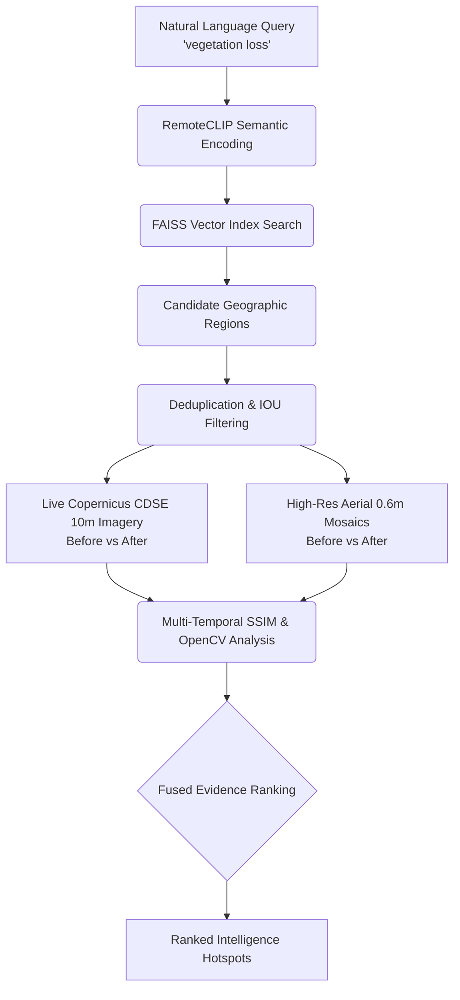

# EarthWatch — SIH 26227: Semantic Retrieval & Multi-Temporal Change Analysis

EarthWatch is an advanced urban change intelligence platform built for **SIH 26227**. It seamlessly fuses multi-spectral satellite imagery, high-resolution visual mosaics, and AI semantic retrieval to automatically discover and monitor land use, structural development, and environmental changes.

## Final Unified Pipeline Architecture

EarthWatch employs a fully automated, multi-modal pipeline triggered by natural language.



### Core Features

- **Automated Discovery Engine**: Instead of manually drawing Area-of-Interest (AOI) polygons, analysts search using human language (e.g., "new construction", "water body depletion"). The system automatically vectors the query through a `RemoteCLIP` model to locate candidate regions matching the description.
- **Zero-Touch Verification**: Candidate tiles are automatically validated via the `/api/discover-and-verify` endpoint. The backend synchronously downloads multi-temporal scenes (2022 vs 2025) and verifies physical changes.
- **Multi-Temporal Imagery Acquisition**: Connects directly to real, live APIs including Copernicus Data Space Ecosystem (CDSE) for Sentinel-2 10m bands and ArcGIS Wayback for 0.6m high-resolution composites.
- **Spectral Fusion & Analysis**: Uses Structural Similarity Index Measure (SSIM) and BGR pixel differencing algorithms via OpenCV to establish physical ground truth.
- **Fused Evidence Scoring**: Combines semantic alignment (AI confidence) with spectral changes (pixel deltas) to produce a highly accurate, unified Evidence Score out of 100.
- **Interactive UI**: A dark-mode, glassmorphic React dashboard supporting split-slider comparisons, optical overlays, SSIM difference matrices, and vegetation masks.

---

## Technical Stack

### Frontend
- **React (Vite)**
- **React Leaflet**: For spatial bounding box visualization and candidate mapping.
- **Vanilla CSS**: Custom styling prioritizing a premium, intelligence-workstation aesthetic.

### Backend
- **FastAPI / Uvicorn**: High-performance synchronous and async python server.
- **OpenCV & NumPy**: For image manipulation, color differencing, and SSIM analysis.
- **FAISS**: Facebook AI Similarity Search for sub-millisecond retrieval against RemoteCLIP embeddings.
- **Requests & Aiohttp**: For rapid downloading from CDSE and mapping APIs.

---

## Running the Platform

### 1. Environment Configuration

You must configure the `.env` file at the root directory with the following variables.

**Copernicus Sentinel Hub Credentials (Required for Live Multi-Spectral)**
```env
SH_CLIENT_ID=your_copernicus_client_id
SH_CLIENT_SECRET=your_copernicus_client_secret
```

### 2. Start the Python Backend
Ensure you have `uv` or `pip` installed, then boot the Uvicorn server on port 8000:
```bash
# Using standard Python venv
source .venv/bin/activate
uvicorn backend.main:app --host 0.0.0.0 --port 8000
```

### 3. Start the React Frontend
In a new terminal instance, start the Vite development server on port 5173:
```bash
npm install
npm run dev
```

Visit `http://localhost:5173` to access the EarthWatch console.

---

## API Documentation

- `POST /api/discover-and-verify`: The core entrypoint. Accepts `{"query": "string", "top_k": int}`. Executes semantic search, deduplicates tiles, acquires temporal Sentinel-2/Wayback imagery, runs multi-temporal optical analysis, calculates SSIM, and returns ranked `.png` paths for the frontend.
- `GET /api/retrieval/index/status`: Returns the number of indexed scenes currently loaded into the FAISS memory vector store.

---

## Strict Data Integrity Policy

1. **No Synthetic Imagery**: The pipeline never generates placeholder images or synthetic noise arrays. If satellite imagery fails to download, it is omitted.
2. **True Fused Metrics**: Image-derived metrics (Optical Change %, SSIM %) are calculated against the physical pixels fetched during the session.
3. **Automated Sub-Agent Verification**: The repository contains robust automated UI scripts and python smoke tests (`scratch/live_smoke_test_v2.py`) to guarantee CDSE API compatibility.